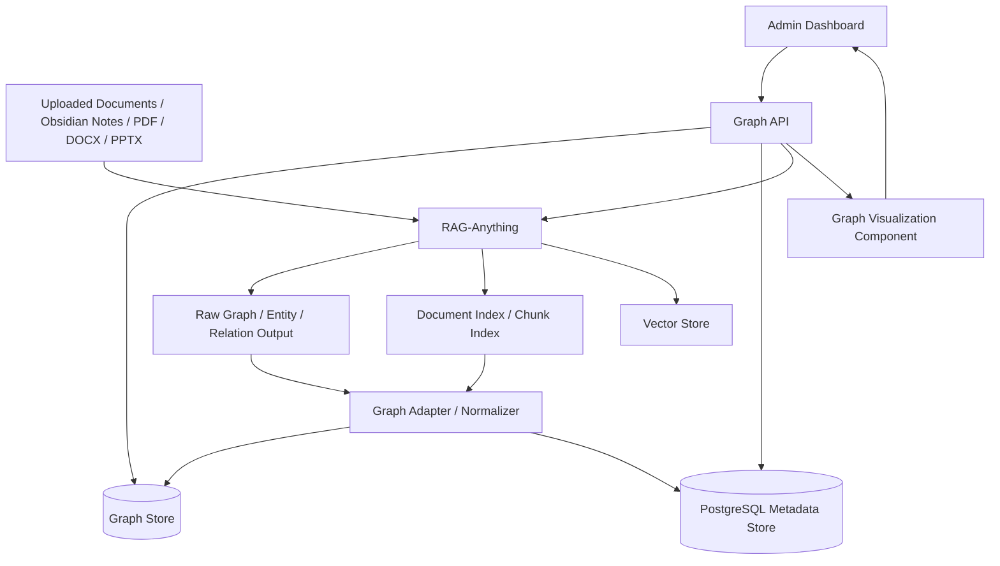
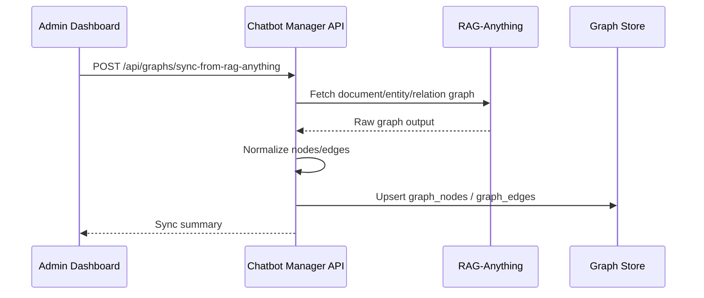

# Graph Module Implementation Guide
## สำหรับระบบ Chatbot Manager / Admin Dashboard + RAG-Anything

**Scope:** เอกสารนี้เน้นเฉพาะการออกแบบและ implement ส่วน **Knowledge Graph Visualization** ใน Admin Dashboard  
**System Context:** ระบบมี Chatbot Manager/Admin Dashboard สำหรับจัดการ LINE, Facebook Messenger, Knowledge, RAG-Anything, LLM Model และ API Key อยู่แล้ว  
**Goal:** เพิ่มความสามารถในการ plot graph คล้าย Obsidian และ graph เชิงองค์ความรู้ เพื่อช่วยดูแลคลังความรู้นิติวิทยาศาสตร์

---

# 1. เป้าหมายของ Graph Module

ระบบต้องรองรับ graph 2 แบบหลัก:

1. **Document Graph**
   - Graph ระดับไฟล์/เอกสาร/section/note
   - หน้าตาคล้าย Obsidian Graph View
   - ใช้สำหรับผู้ดูแลคลังความรู้ ตรวจสอบว่าเอกสารใดเชื่อมโยงกัน หัวข้อใดโดดเดี่ยว และเอกสารใดเป็นศูนย์กลางของ knowledge base

2. **Concept Knowledge Graph**
   - Graph ระดับ concept/entity/process/method/evidence type
   - ใช้ดูความสัมพันธ์ขององค์ความรู้จริง เช่น `DNA sample → degradation → allele dropout → partial STR profile`
   - ใช้สนับสนุนการตรวจสอบคำตอบของ RAG และช่วยวิเคราะห์ coverage ของความรู้

**Important:**  
Graph Module ไม่ต้องสร้าง RAG ใหม่ และไม่ต้องแทนที่ RAG-Anything  
Graph Module มีหน้าที่:
- ดึง graph data จาก RAG-Anything หรือ graph store
- normalize ให้เป็น format กลาง
- plot graph ใน Admin Dashboard
- filter/search/explore graph
- เชื่อม node กลับไปยัง source document, chunk, table, image, citation และ test query

---

# 2. Overall Architecture



---

# 3. Graph Types

## 3.1 Document Graph

### Purpose

ใช้แสดงความเชื่อมโยงระดับเอกสาร เหมือน Obsidian Graph View

### Node Types

| Node Type | Description |
|---|---|
| `document` | ไฟล์เอกสารหลัก เช่น PDF, DOCX, Markdown |
| `note` | Obsidian note หรือ markdown note |
| `section` | section/subsection ภายในเอกสาร |
| `chunk` | chunk ที่ถูกใช้ใน RAG |
| `source_group` | กลุ่มเอกสาร เช่น DNA, Fingerprint, Toxicology |

### Edge Types

| Edge Type | Description |
|---|---|
| `links_to` | เอกสารหนึ่ง link ไปอีกเอกสารหนึ่ง |
| `cites` | เอกสารอ้างถึงเอกสารอื่น |
| `contains` | document contains section/chunk |
| `same_topic` | เอกสารอยู่ใน topic เดียวกัน |
| `derived_from` | section/chunk derived from source document |
| `updated_by` | เอกสารใหม่ update หรือแทนเอกสารเดิม |
| `related_document` | ความสัมพันธ์ทั่วไปจาก metadata หรือ RAG-Anything |

### Example

```text
DNA Evidence Guide.pdf
  ├── contains → Section: STR Profiling
  ├── contains → Section: Sample Degradation
  ├── related_document → Chain of Custody SOP.pdf
  └── related_document → DNA Interpretation Guideline.pdf
```

---

## 3.2 Concept Knowledge Graph

### Purpose

ใช้แสดงความสัมพันธ์ขององค์ความรู้จริงระดับ concept/entity/process

### Node Types

| Node Type | Description |
|---|---|
| `concept` | แนวคิดหลัก เช่น DNA degradation |
| `entity` | entity ที่ extract ได้ เช่น STR profile, PCR inhibitor |
| `method` | วิธีตรวจหรือวิธีวิเคราะห์ |
| `evidence_type` | ประเภทหลักฐาน เช่น biological evidence, fingerprint |
| `process` | กระบวนการ เช่น sample collection, extraction |
| `risk` | ความเสี่ยง เช่น contamination, allele dropout |
| `limitation` | ข้อจำกัดในการตรวจหรือแปลผล |
| `interpretation` | หลักการแปลผล |
| `case_context` | context ที่เกี่ยวข้องกับคดี แต่ต้องควบคุม policy |

### Edge Types

| Edge Type | Description |
|---|---|
| `related_to` | เกี่ยวข้องทั่วไป |
| `causes` | เป็นสาเหตุของ |
| `affects` | ส่งผลต่อ |
| `increases_risk_of` | เพิ่มความเสี่ยงของ |
| `requires` | ต้องใช้ |
| `part_of` | เป็นส่วนหนึ่งของ |
| `limits` | จำกัดหรือทำให้ตีความยากขึ้น |
| `used_for` | ใช้เพื่อ |
| `detected_by` | ตรวจพบโดย |
| `interpreted_with` | ต้องตีความร่วมกับ |
| `supported_by` | สนับสนุนโดยเอกสาร/section/chunk |

### Example

```text
DNA sample
  → degradation
  → low template DNA
  → allele dropout
  → partial STR profile
  → interpretation limitation
```

---

# 4. Shared Graph Data Model

ใช้ schema เดียวกันสำหรับ Document Graph และ Concept Graph โดยแยกด้วย `graph_type`

## 4.1 Node Schema

```ts
export type GraphNodeType =
  | "document"
  | "note"
  | "section"
  | "chunk"
  | "source_group"
  | "concept"
  | "entity"
  | "method"
  | "evidence_type"
  | "process"
  | "risk"
  | "limitation"
  | "interpretation"
  | "case_context"
  | "table"
  | "image"
  | "equation";

export interface GraphNode {
  id: string;
  label: string;
  type: GraphNodeType;
  graph_type: "document_graph" | "concept_graph" | "multimodal_graph";

  domain?: string; 
  // examples: forensic_biology, fingerprint, toxicology, crime_scene, digital_forensics

  source_document_id?: string;
  source_document_title?: string;
  source_chunk_id?: string;

  status?: "draft" | "reviewed" | "approved" | "archived" | "restricted";
  visibility?: "public" | "internal" | "expert_only" | "restricted";

  confidence?: number; 
  // 0.0 - 1.0

  source_count?: number;
  retrieval_count?: number;
  degree?: number;

  metadata?: Record<string, any>;
}
```

## 4.2 Edge Schema

```ts
export type GraphEdgeType =
  | "links_to"
  | "cites"
  | "contains"
  | "same_topic"
  | "derived_from"
  | "updated_by"
  | "related_document"
  | "related_to"
  | "causes"
  | "affects"
  | "increases_risk_of"
  | "requires"
  | "part_of"
  | "limits"
  | "used_for"
  | "detected_by"
  | "interpreted_with"
  | "supported_by";

export interface GraphEdge {
  id: string;
  source: string;
  target: string;
  type: GraphEdgeType;

  graph_type: "document_graph" | "concept_graph" | "multimodal_graph";

  label?: string;
  weight?: number;
  confidence?: number;

  source_document_id?: string;
  source_chunk_id?: string;

  direction?: "directed" | "undirected";

  metadata?: Record<string, any>;
}
```

## 4.3 API Response Schema

```ts
export interface GraphResponse {
  graph_type: "document_graph" | "concept_graph" | "multimodal_graph";
  query?: string;
  center_node_id?: string;
  depth?: number;

  nodes: GraphNode[];
  edges: GraphEdge[];

  stats: {
    node_count: number;
    edge_count: number;
    visible_node_count: number;
    visible_edge_count: number;
    filtered: boolean;
  };

  warnings?: string[];
}
```

---

# 5. Backend Graph API

ให้เพิ่ม Graph API ใน Chatbot Manager backend

## 5.1 Required Endpoints

```http
GET /api/graphs/document/global
GET /api/graphs/document/local?node_id={node_id}&depth=2

GET /api/graphs/concept/global
GET /api/graphs/concept/local?node_id={node_id}&depth=2

GET /api/graphs/search?q={query}&graph_type=document_graph|concept_graph|all
GET /api/graphs/node/{node_id}
GET /api/graphs/node/{node_id}/sources
GET /api/graphs/node/{node_id}/neighbors?depth=1
GET /api/graphs/node/{node_id}/test-query
```

## 5.2 Optional Endpoints

```http
GET /api/graphs/stats
GET /api/graphs/domains
GET /api/graphs/orphan-nodes?graph_type=document_graph
GET /api/graphs/top-nodes?graph_type=concept_graph&metric=degree&limit=50
GET /api/graphs/export?graph_type=concept_graph&format=json|graphml|csv
POST /api/graphs/rebuild
POST /api/graphs/sync-from-rag-anything
```

---

# 6. Graph Adapter / Normalizer

## 6.1 Responsibility

Graph Adapter เป็นชั้นกลางที่แปลงข้อมูลจาก RAG-Anything ให้เป็น schema กลางของระบบ

```text
RAG-Anything raw graph/entity/relation output
      ↓
Graph Adapter
      ↓
Normalized GraphNode / GraphEdge
      ↓
Graph Store
      ↓
Graph API
      ↓
Admin Dashboard
```

## 6.2 Required Functions

```ts
interface GraphAdapter {
  syncFromRagAnything(): Promise<SyncResult>;

  normalizeDocumentGraph(raw: any): Promise<GraphResponse>;

  normalizeConceptGraph(raw: any): Promise<GraphResponse>;

  getGlobalGraph(params: GlobalGraphParams): Promise<GraphResponse>;

  getLocalGraph(params: LocalGraphParams): Promise<GraphResponse>;

  searchNodes(params: SearchParams): Promise<GraphNode[]>;

  getNodeSources(nodeId: string): Promise<NodeSource[]>;
}
```

## 6.3 Normalization Rules

### Document Graph

- File/document becomes `document` node
- Markdown note becomes `note` node
- Heading/section becomes `section` node
- Chunk becomes `chunk` node
- Parent-child relation becomes `contains`
- Explicit link/citation becomes `links_to` or `cites`
- Same metadata topic becomes `same_topic`

### Concept Graph

- Extracted concept/entity becomes `concept` or `entity` node
- Method/process/risk/limitation should be typed when possible
- Relationship from RAG-Anything becomes semantic edge
- If relation type is unknown, use `related_to`
- Every concept node should preserve source references where possible
- If confidence is available, map to `confidence`
- If no confidence available, set `confidence = null`, not `0`

---

# 7. Graph Store Recommendation

## Option A: PostgreSQL Only

เหมาะสำหรับ MVP

Tables:
- `graph_nodes`
- `graph_edges`
- `graph_node_sources`
- `graph_sync_jobs`

ข้อดี:
- ง่าย
- อยู่กับระบบเดิมได้
- query/filter พื้นฐานเพียงพอ

ข้อเสีย:
- graph traversal หลาย hop อาจช้าถ้า graph ใหญ่

## Option B: PostgreSQL + Neo4j

เหมาะสำหรับ production ถ้า graph ใหญ่และต้อง traversal ซับซ้อน

- PostgreSQL เก็บ metadata, permission, dashboard config
- Neo4j เก็บ graph traversal
- API รวมผลลัพธ์ก่อนส่งให้ frontend

## Recommendation

เริ่มจาก **PostgreSQL only** ก่อน แล้วออกแบบ interface ให้เปลี่ยน backend เป็น Neo4j ได้ภายหลัง

---

# 8. Suggested PostgreSQL Schema

## 8.1 graph_nodes

```sql
CREATE TABLE graph_nodes (
  id TEXT PRIMARY KEY,
  label TEXT NOT NULL,
  type TEXT NOT NULL,
  graph_type TEXT NOT NULL,

  domain TEXT,
  source_document_id TEXT,
  source_document_title TEXT,
  source_chunk_id TEXT,

  status TEXT,
  visibility TEXT,

  confidence NUMERIC,
  source_count INTEGER DEFAULT 0,
  retrieval_count INTEGER DEFAULT 0,
  degree INTEGER DEFAULT 0,

  metadata JSONB DEFAULT '{}'::jsonb,

  created_at TIMESTAMP DEFAULT NOW(),
  updated_at TIMESTAMP DEFAULT NOW()
);
```

## 8.2 graph_edges

```sql
CREATE TABLE graph_edges (
  id TEXT PRIMARY KEY,
  source TEXT NOT NULL REFERENCES graph_nodes(id) ON DELETE CASCADE,
  target TEXT NOT NULL REFERENCES graph_nodes(id) ON DELETE CASCADE,
  type TEXT NOT NULL,
  graph_type TEXT NOT NULL,

  label TEXT,
  weight NUMERIC,
  confidence NUMERIC,
  direction TEXT DEFAULT 'directed',

  source_document_id TEXT,
  source_chunk_id TEXT,

  metadata JSONB DEFAULT '{}'::jsonb,

  created_at TIMESTAMP DEFAULT NOW(),
  updated_at TIMESTAMP DEFAULT NOW()
);
```

## 8.3 graph_node_sources

```sql
CREATE TABLE graph_node_sources (
  id TEXT PRIMARY KEY,
  node_id TEXT NOT NULL REFERENCES graph_nodes(id) ON DELETE CASCADE,

  document_id TEXT,
  document_title TEXT,
  chunk_id TEXT,
  page_number INTEGER,
  section_title TEXT,
  excerpt TEXT,

  visibility TEXT,
  status TEXT,

  metadata JSONB DEFAULT '{}'::jsonb,

  created_at TIMESTAMP DEFAULT NOW()
);
```

## 8.4 graph_sync_jobs

```sql
CREATE TABLE graph_sync_jobs (
  id TEXT PRIMARY KEY,
  status TEXT NOT NULL,
  source TEXT NOT NULL DEFAULT 'rag_anything',

  started_at TIMESTAMP DEFAULT NOW(),
  finished_at TIMESTAMP,

  inserted_nodes INTEGER DEFAULT 0,
  updated_nodes INTEGER DEFAULT 0,
  inserted_edges INTEGER DEFAULT 0,
  updated_edges INTEGER DEFAULT 0,

  error_message TEXT,
  metadata JSONB DEFAULT '{}'::jsonb
);
```

---

# 9. Frontend Visualization

## 9.1 Recommended Library

ใช้ **Cytoscape.js** สำหรับ MVP/production เพราะเหมาะกับ interactive knowledge graph และรองรับ:
- node/edge style
- layout หลายแบบ
- filtering
- click event
- local graph
- graph expansion

Alternative:
- Sigma.js ถ้า graph ใหญ่มาก
- D3 force graph ถ้าต้อง custom สูง
- React Flow ไม่เหมาะเป็น graph หลัก แต่เหมาะกับ workflow graph

## 9.2 Main Components

```text
GraphExplorerPage
├── GraphToolbar
│   ├── SearchBox
│   ├── GraphTypeSelector
│   ├── DomainFilter
│   ├── NodeTypeFilter
│   ├── VisibilityFilter
│   ├── StatusFilter
│   ├── DepthSelector
│   └── LayoutSelector
│
├── GraphCanvas
│   └── CytoscapeRenderer
│
├── NodeDetailPanel
│   ├── NodeMetadata
│   ├── SourceDocuments
│   ├── NeighborList
│   ├── RelatedQuestions
│   └── TestQueryButton
│
└── GraphStatsPanel
    ├── NodeCount
    ├── EdgeCount
    ├── OrphanNodes
    ├── TopNodes
    └── CoverageWarnings
```

---

# 10. UI Behavior

## 10.1 Graph Modes

Frontend ต้องมี toggle:

```text
Document Graph | Concept Graph | Multimodal Graph
```

เริ่มต้นให้แสดง:
- Document Graph: global top-level view
- Concept Graph: local graph around selected domain/topic
- Multimodal Graph: disabled by default unless user selects document/node

## 10.2 Local Graph Default

เพื่อไม่ให้ graph รก ให้ใช้ local graph เป็น default:

```text
Default depth = 2 hops
Max depth = 3 hops
Default node limit = 200
Default edge limit = 500
```

ถ้าผลลัพธ์เกิน limit ให้ API ส่ง warning:

```json
{
  "warnings": [
    "Graph result was truncated to 200 nodes. Use filters to narrow the view."
  ]
}
```

## 10.3 Node Click Behavior

เมื่อคลิก node:
1. Highlight selected node
2. Highlight 1-hop neighbors
3. เปิด Node Detail Panel
4. แสดง source/citation
5. แสดง neighbor list
6. มีปุ่ม:
   - `Expand 1-hop`
   - `Show sources`
   - `Test chatbot query`
   - `Open source document`
   - `Hide node`

## 10.4 Edge Click Behavior

เมื่อคลิก edge:
1. แสดง relation type
2. แสดง confidence/weight
3. แสดง source evidence
4. แสดง source document/chunk ที่สนับสนุนความสัมพันธ์นี้

---

# 11. Styling Rules

## 11.1 Node Color by Type

```ts
const nodeTypeColors = {
  document: "#4B7BEC",
  note: "#45AAF2",
  section: "#2D98DA",
  chunk: "#A5B1C2",

  concept: "#20BF6B",
  entity: "#26DE81",
  method: "#8854D0",
  evidence_type: "#FA8231",
  process: "#F7B731",
  risk: "#EB3B5A",
  limitation: "#FC5C65",
  interpretation: "#A55EEA",

  table: "#778CA3",
  image: "#FD9644",
  equation: "#FED330"
};
```

## 11.2 Node Size

```text
node size = base size + log(degree + retrieval_count + source_count)
```

Suggested:
- min size: 16 px
- max size: 64 px

## 11.3 Edge Style

```text
directed edge: arrow
undirected edge: no arrow
confidence high: solid line
confidence medium: dashed line
confidence low: dotted line
```

## 11.4 Visibility

- `public`: normal opacity
- `internal`: slightly muted
- `expert_only`: lock icon
- `restricted`: red outline or shield icon

---

# 12. Graph Filters

Required filters:

```text
- graph_type
- domain
- node_type
- edge_type
- document_status
- visibility
- confidence_min
- source_document
- orphan_only
- retrieved_recently
```

Recommended forensic domains:

```text
- forensic_biology
- fingerprint
- toxicology
- crime_scene
- digital_forensics
- forensic_chemistry
- forensic_pathology
- evidence_handling
- chain_of_custody
```

---

# 13. Permission and Safety

Graph may expose sensitive knowledge. Apply role-based access control.

## 13.1 Roles

```text
admin
expert_reviewer
content_editor
viewer
```

## 13.2 Visibility Rules

| Visibility | admin | expert_reviewer | content_editor | viewer |
|---|---:|---:|---:|---:|
| public | yes | yes | yes | yes |
| internal | yes | yes | yes | no |
| expert_only | yes | yes | no | no |
| restricted | yes | optional | no | no |

## 13.3 API Enforcement

Do not rely only on frontend hiding.  
Backend must filter nodes and edges by role before returning graph data.

---

# 14. Integration with RAG-Anything

## 14.1 Sync Flow



## 14.2 Query-Time Integration

When user asks a question in LINE/Facebook, chatbot can store retrieval metadata:

```text
user query
  → RAG-Anything retrieval
  → retrieved nodes/chunks
  → update retrieval_count on graph_nodes
  → show hot/retrieved nodes in dashboard
```

This makes graph useful for monitoring real usage.

---

# 15. Graph Analytics

Add basic analytics for admin:

## 15.1 Required Metrics

```text
- total nodes
- total edges
- nodes by type
- edges by type
- orphan documents
- orphan concepts
- top connected nodes
- most retrieved nodes
- low-confidence relations
- restricted nodes exposed to public graph check
```

## 15.2 Useful Admin Views

```text
1. Orphan Knowledge
   - nodes/documents with no edge
   - useful for identifying missing links

2. High-Impact Concepts
   - high degree + high retrieval_count
   - useful for identifying important topics

3. Weak Relations
   - low confidence edges
   - useful for expert review

4. Knowledge Coverage by Domain
   - node/edge count by forensic domain
   - useful for deciding where to add content
```

---

# 16. Example API Responses

## 16.1 Document Graph Response

```json
{
  "graph_type": "document_graph",
  "center_node_id": "doc_dna_guide",
  "depth": 2,
  "nodes": [
    {
      "id": "doc_dna_guide",
      "label": "DNA Evidence Guide",
      "type": "document",
      "graph_type": "document_graph",
      "domain": "forensic_biology",
      "status": "approved",
      "visibility": "public",
      "source_count": 1,
      "retrieval_count": 55,
      "degree": 8
    },
    {
      "id": "sec_str_profiling",
      "label": "STR Profiling",
      "type": "section",
      "graph_type": "document_graph",
      "domain": "forensic_biology",
      "source_document_id": "doc_dna_guide",
      "status": "approved",
      "visibility": "public",
      "degree": 3
    }
  ],
  "edges": [
    {
      "id": "edge_doc_dna_contains_str",
      "source": "doc_dna_guide",
      "target": "sec_str_profiling",
      "type": "contains",
      "graph_type": "document_graph",
      "direction": "directed",
      "confidence": 1.0
    }
  ],
  "stats": {
    "node_count": 2,
    "edge_count": 1,
    "visible_node_count": 2,
    "visible_edge_count": 1,
    "filtered": false
  }
}
```

## 16.2 Concept Graph Response

```json
{
  "graph_type": "concept_graph",
  "center_node_id": "concept_dna_degradation",
  "depth": 2,
  "nodes": [
    {
      "id": "concept_dna_degradation",
      "label": "DNA degradation",
      "type": "concept",
      "graph_type": "concept_graph",
      "domain": "forensic_biology",
      "status": "approved",
      "visibility": "public",
      "confidence": 0.91,
      "source_count": 5,
      "retrieval_count": 42,
      "degree": 6
    },
    {
      "id": "concept_allele_dropout",
      "label": "Allele dropout",
      "type": "risk",
      "graph_type": "concept_graph",
      "domain": "forensic_biology",
      "status": "approved",
      "visibility": "internal",
      "confidence": 0.86,
      "source_count": 3,
      "retrieval_count": 18,
      "degree": 4
    }
  ],
  "edges": [
    {
      "id": "edge_degradation_dropout",
      "source": "concept_dna_degradation",
      "target": "concept_allele_dropout",
      "type": "increases_risk_of",
      "graph_type": "concept_graph",
      "label": "increases risk of",
      "weight": 0.82,
      "confidence": 0.86,
      "direction": "directed",
      "source_document_id": "doc_dna_guide",
      "source_chunk_id": "chunk_112"
    }
  ],
  "stats": {
    "node_count": 2,
    "edge_count": 1,
    "visible_node_count": 2,
    "visible_edge_count": 1,
    "filtered": false
  }
}
```

---

# 17. Frontend Implementation Notes

## 17.1 Cytoscape Element Mapping

```ts
const elements = [
  ...nodes.map(node => ({
    data: {
      id: node.id,
      label: node.label,
      type: node.type,
      graphType: node.graph_type,
      domain: node.domain,
      visibility: node.visibility,
      confidence: node.confidence,
      retrievalCount: node.retrieval_count,
      sourceCount: node.source_count,
      degree: node.degree
    }
  })),

  ...edges.map(edge => ({
    data: {
      id: edge.id,
      source: edge.source,
      target: edge.target,
      label: edge.label ?? edge.type,
      type: edge.type,
      confidence: edge.confidence,
      weight: edge.weight
    }
  }))
];
```

## 17.2 Layout Options

Provide these layout options:

```text
cose        force-directed, good default
breadthfirst hierarchy/tree-like view
circle      small graph overview
grid        debugging/layout stability
concentric  centrality-based view
```

Default:
- Document Graph: `cose`
- Concept Graph: `cose`
- Local graph around selected node: `concentric` or `cose`

---

# 18. Implementation Steps for Coding Agent

## Phase 1: Backend Data Model

- [ ] Create `graph_nodes` table
- [ ] Create `graph_edges` table
- [ ] Create `graph_node_sources` table
- [ ] Create `graph_sync_jobs` table
- [ ] Add indexes for `graph_type`, `type`, `domain`, `visibility`, `status`
- [ ] Add role-based filtering utility

## Phase 2: Graph Adapter

- [ ] Create `GraphAdapter` service
- [ ] Implement `syncFromRagAnything()`
- [ ] Implement `normalizeDocumentGraph()`
- [ ] Implement `normalizeConceptGraph()`
- [ ] Implement node/edge upsert
- [ ] Deduplicate nodes by normalized label + type + domain
- [ ] Preserve source document/chunk references

## Phase 3: Graph API

- [ ] Implement global document graph endpoint
- [ ] Implement local document graph endpoint
- [ ] Implement global concept graph endpoint
- [ ] Implement local concept graph endpoint
- [ ] Implement search endpoint
- [ ] Implement node detail endpoint
- [ ] Implement node sources endpoint
- [ ] Implement graph stats endpoint

## Phase 4: Frontend Graph Explorer

- [ ] Add Graph Explorer page in Admin Dashboard
- [ ] Add graph type switcher
- [ ] Add search box
- [ ] Add filters
- [ ] Add Cytoscape renderer
- [ ] Add node detail panel
- [ ] Add edge detail panel
- [ ] Add graph stats panel
- [ ] Add expand node action
- [ ] Add open source document action

## Phase 5: RAG Usage Integration

- [ ] When RAG-Anything returns retrieved chunks/entities, update `retrieval_count`
- [ ] Store query-node relationship if available
- [ ] Add “most retrieved nodes” analytics
- [ ] Add “test chatbot query from node” action

## Phase 6: Safety and Permissions

- [ ] Apply backend role-based visibility filter
- [ ] Prevent restricted nodes from being exposed to unauthorized users
- [ ] Add visual markers for `expert_only` and `restricted`
- [ ] Add warning when graph contains low-confidence or restricted edges

---

# 19. Acceptance Criteria

## Document Graph

- [ ] Admin can view global document graph
- [ ] Admin can search document/note/section nodes
- [ ] Admin can click document node and see sections/chunks
- [ ] Admin can view local graph around a document
- [ ] Orphan documents can be identified
- [ ] Document graph supports filter by domain/status/visibility

## Concept Knowledge Graph

- [ ] Admin can view concept graph by domain
- [ ] Admin can search concept/entity/method/risk nodes
- [ ] Admin can click node and see relations
- [ ] Admin can view source documents/chunks behind a node
- [ ] Admin can view source evidence behind an edge
- [ ] Admin can view low-confidence relations
- [ ] Concept graph supports local 1-hop/2-hop exploration
- [ ] Restricted/expert-only nodes are protected by backend permission checks

## Integration

- [ ] Graph sync from RAG-Anything works
- [ ] Graph data can be refreshed without breaking existing dashboard
- [ ] Retrieval count is updated from real chatbot usage
- [ ] Graph API response follows the shared schema
- [ ] Frontend can render graph with at least 200 nodes and 500 edges smoothly

---

# 20. Non-Goals

Do not implement these in this graph module:

```text
- Do not build a new RAG engine
- Do not replace RAG-Anything retrieval
- Do not implement LINE/Facebook webhook here
- Do not implement LLM prompt management here
- Do not implement full document editor here
- Do not allow editing source knowledge directly from graph in Phase 1
```

Graph Module should only visualize, inspect, filter, and connect graph nodes back to sources and RAG usage.

---

# 21. Recommended MVP Scope

For first implementation, build only:

```text
1. PostgreSQL graph_nodes / graph_edges / graph_node_sources
2. GraphAdapter with mocked RAG-Anything raw input support
3. Document Graph local/global API
4. Concept Graph local/global API
5. React + Cytoscape.js Graph Explorer
6. Search, filter, node click, source panel
7. Basic role-based visibility filter
```

Postpone:
```text
- Neo4j
- Graph edit mode
- Advanced analytics
- Multimodal graph deep view
- Real-time graph updates
- Graph-based RAG reranking
```

---

# 22. Final Implementation Principle

The graph should be useful for knowledge governance, not just visual decoration.

Every node and edge should answer at least one of these questions:

```text
- What source supports this knowledge?
- How is this concept connected to other concepts?
- Which documents are central or isolated?
- Which knowledge areas are weak or missing?
- Which concepts are frequently retrieved by users?
- Which relations require expert review?
```

If a node or edge cannot be traced back to a source, mark it as low-confidence or review-required.

